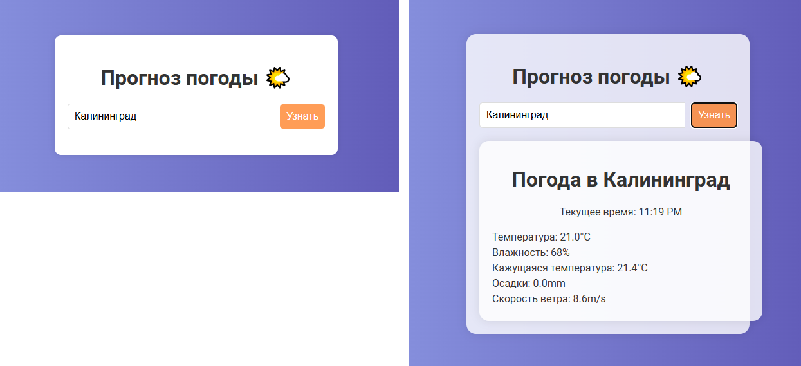

# Документация к weather-api 

## Описание
Приложение предоставляет прогноз погоды для заданного города, используя Open-Meteo API для получения метеорологических данных. Пользователь может вводить название города и получать актуальную информацию о погоде.

## Реализованные функции
- **Поиск города**: Поиск осуществляется через получение координат по названию, и дальнейший поиск по open-meteo.
- **Автозаполнение названия города при вводе**: Выпадающий список при помощи дополнительного эндпоинта с GET-запросом.
- **Получение прогноза погоды**: Отображает текущую температуру, влажность, осадки и скорость ветра.
- **Сохранение последнего введенного города**: Сохранение куки - при повторном заходе на сайт в поле ввода отображается последний введенный город.
- **Написаны тесты**
- **Проект помещен в докер-контейнер**
- **Удобный интерфейс**

## API
- **POST /weather/**
  - **Описание**: Получает данные о погоде для указанного города.
  - **Тело запроса**:
    ```json
    {
      "city_data": "Название города"
    }
    ```
  - **Ответ**: HTML-страница с данными о погоде.

- **GET /weather/autocomplete**
  - **Описание**: Возвращает список подсказок для названия города.
  - **Параметры**: 
    - `query`: Часть названия города для поиска.

## Используемые технологии
- **FastAPI**: Веб-фреймворк для разработки API.
- **Pydantic**: Валидация строки.
- **timezonefinder**: Библиотека для поиска координат по названию города.
- **geopy**: Библиотека для поиска часового пояса.
- **requests**: Библиотека для выполнения асинхронных HTTP-запросов.
- **Jinja2**: Шаблонизатор для генерации HTML.
- **HTML/CSS/JavaScript**: Для фронтенд-части приложения.
- **python-dotenv**: Для загрузки конфигурации безопасным способом.
- **pydantic-settings**: Валидация конфигурационного файла.

## Запуск приложения
1. Убедитесь, что у вас установлен Python (версия 3.7 или выше).
2. Установите зависимости:
   ```bash
   pip install fastapi uvicorn httpx geopy timezonefinder pytz
